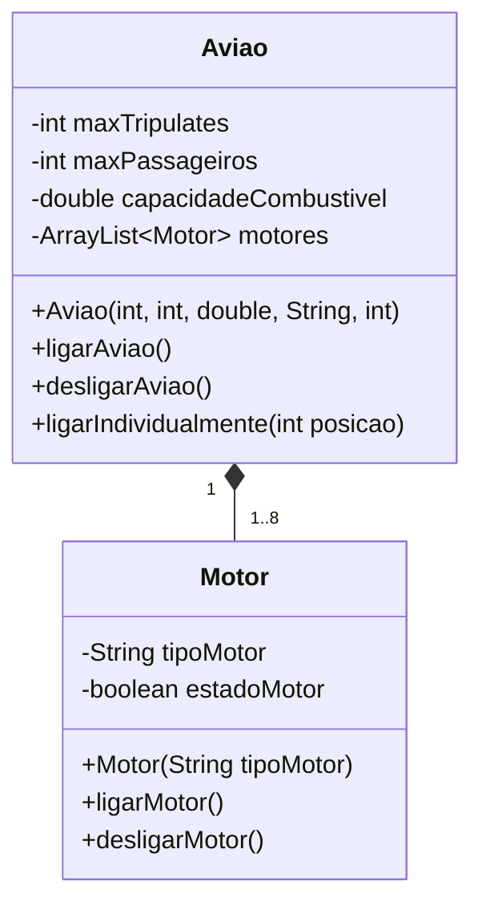

```mermaid
classDiagram 
class Aviao {
        -int maxTripulates
        -int maxPassageiros
        -double capacidadeCombustivel
        -ArrayList~Motor~ motores
        +Aviao(int, int, double, String, int)
        +ligarAviao()
        +desligarAviao()
        +ligarIndividualmente(int posicao)
    }

    class Motor {
        -String tipoMotor
        -boolean estadoMotor
        +Motor(String tipoMotor)
        +ligarMotor()
        +desligarMotor()
    }
    
    Aviao "1" *-- "1..8" Motor
```
