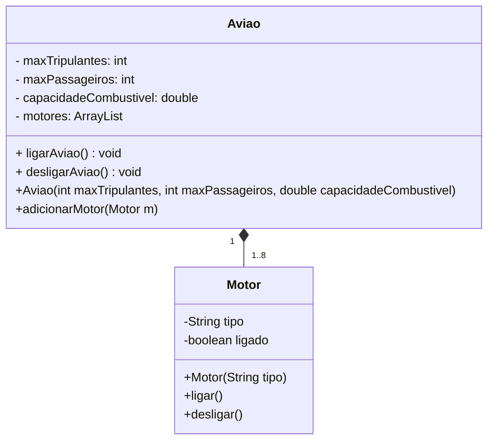

```mermaid
classDiagram 
    class Aviao {
        - maxTripulantes: int
        - maxPassageiros: int
        - capacidadeCombustivel: double
        - motores: ArrayList<Motor>
        + ligarAviao() void
        + desligarAviao() void
        +Aviao(int maxTripulantes, int maxPassageiros, double capacidadeCombustivel)
        +adicionarMotor(Motor m)
    }
    
    class Motor {
        -String tipo
        -boolean ligado
        +Motor(String tipo)
        +ligar()
        +desligar()
    }
    
    Aviao "1" *-- "1..8" Motor
```