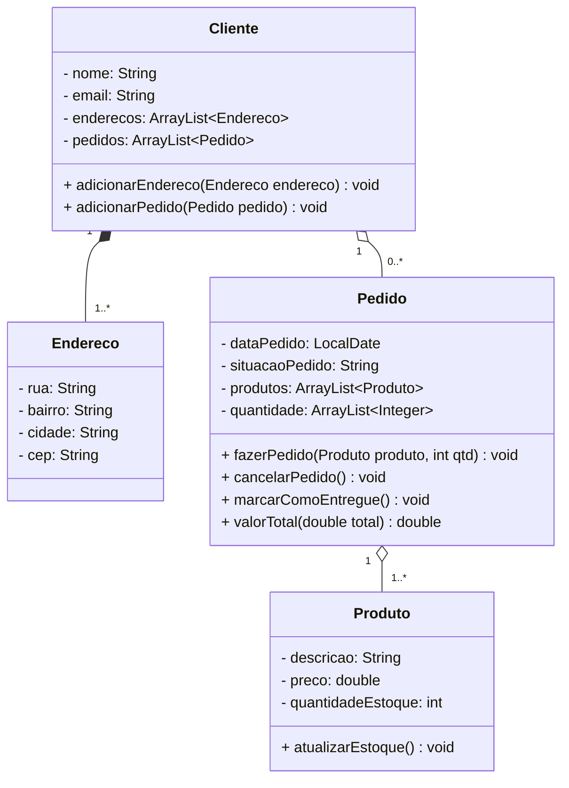
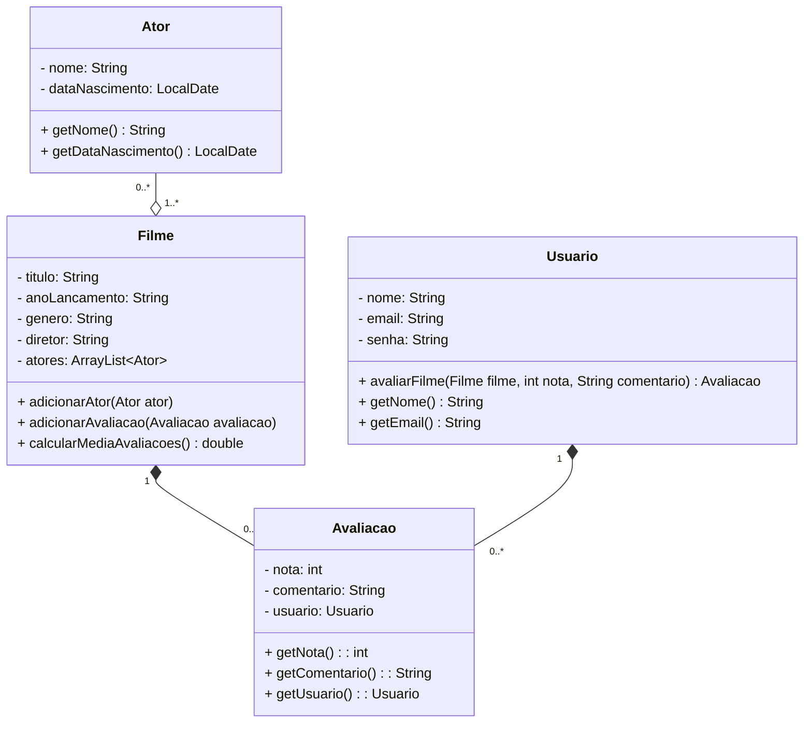
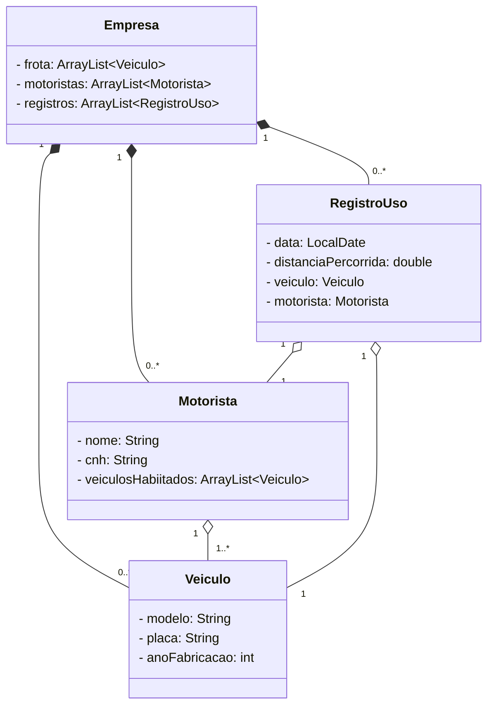
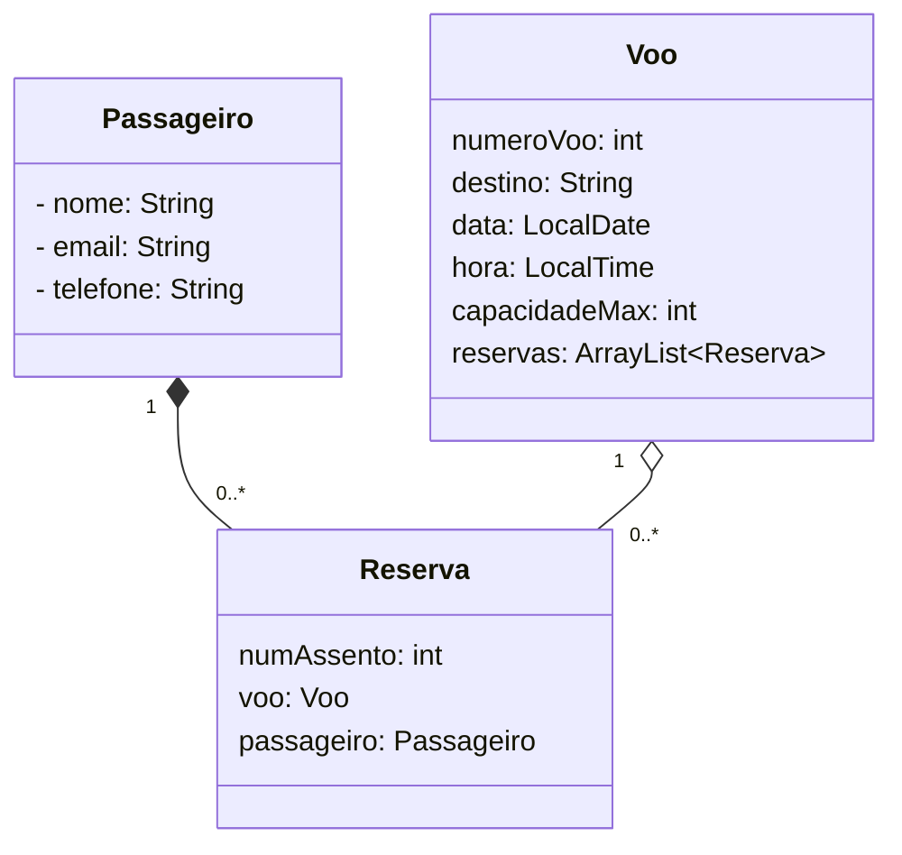

## 1.1 Sistema de comércio eletrônico
Um produto tem uma descrição, um preço e uma quantidade em estoque. Um cliente tem um nome, um
e-mail e um ou mais endereços de entrega. Um cliente pode fazer um ou mais pedidos. Um pedido tem uma
data, uma situação (pendente, pago, entregue, cancelado), um ou mais produtos, sendo que cada produto
tem uma quantidade e um preço unitário.

## 1.2 Sistema de avaliação de filmes
Um filme tem um título, um ano de lançamento, um gênero, um diretor e um ou mais atores. Um ator tem
um nome e uma data de nascimento. Um filme pode ter uma ou mais avaliações, e cada avaliação está
associada a um único filme e a um único usuário. Um usuário tem um nome, um e-mail e uma senha. Um
usuário pode avaliar um ou mais filmes. Uma avaliação tem uma nota (de 1 a 5) e um comentário.

## 1.3 Sistema de Gestão de Frotas
Uma empresa possui uma frota de veículos. Cada veículo tem um modelo, uma placa e um ano de fabricação.
A empresa tem vários motoristas, e cada motorista pode dirigir um ou mais veículos. A empresa
registra o uso de cada veículo, incluindo a data, o motorista e a distância percorrida.

## 1.4 Sistema de reserva de passagens aéreas
Uma companhia aérea oferece voos para diversos destinos. Cada voo tem um número de voo, um destino,
uma data e uma hora de partida, e uma capacidade máxima de passageiros. Os passageiros podem reservar
assentos em um voo, e cada reserva está associada a um único passageiro e a um único voo. Um passageiro
tem um nome, um e-mail e um número de telefone.

